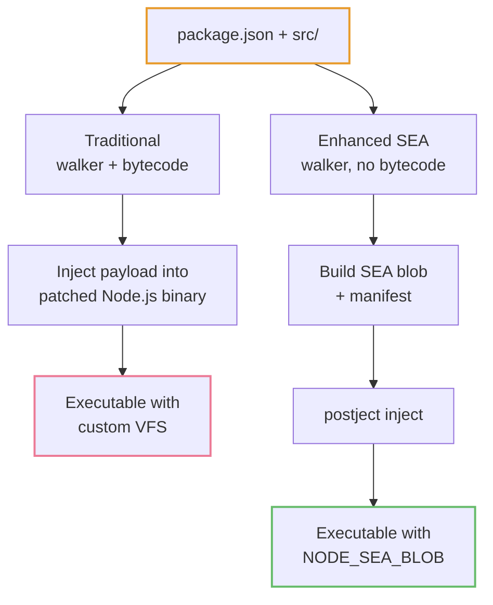
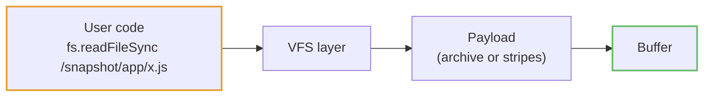

# Architecture

How `pkg` turns a Node.js project into a single executable, at a glance.

::: tip Looking for deeper internals?
This page is the short version — build pipelines, binary layout, VFS provider, worker-thread bootstrap, and patch tables all live in **[`docs/ARCHITECTURE.md`](https://github.com/yao-pkg/pkg/blob/main/docs/ARCHITECTURE.md)**. Read that one if you're contributing to `pkg` or debugging the runtime.
:::

## The two modes

`pkg` supports two packaging strategies, selected via the `--sea` flag:

```bash
pkg .                     # Traditional mode (default)
pkg . --sea               # Enhanced SEA mode (Node ≥ 22 with package.json)
pkg single-file.js --sea  # Simple SEA mode (single .js file)
```

Both start from the same project and end with one executable, but they take very different paths:



| Aspect         | Traditional           | Enhanced SEA         |
| -------------- | --------------------- | -------------------- |
| Node.js API    | Binary patching       | Official `node:sea`  |
| Base binary    | Patched (`pkg-fetch`) | Stock                |
| VFS            | Custom binary format  | `@roberts_lando/vfs` |
| Bytecode       | V8 compiled           | Source as-is         |
| ESM            | Transformed to CJS    | Native               |
| Compression    | Brotli / GZip         | None                 |
| Code stripping | Yes (`sourceless`)    | No (plaintext)       |

See **[SEA vs Standard](/guide/sea-vs-standard)** for the full decision guide.

## Traditional mode in one paragraph

The walker parses the entry file, resolves every `require`/`import`, transforms ESM to CJS, and compiles each module to V8 bytecode. Files are serialized into "stripes" (path + store type + data), optionally compressed, and injected into a patched Node.js binary at placeholder offsets. At runtime, the injected `bootstrap.js` patches `fs`, `Module`, `child_process`, and `process.dlopen` so that anything inside `/snapshot/` is served from the payload instead of disk.

Strength: V8 bytecode can be stored without source, so code is not trivially extractable. Weakness: the patched binary comes from `pkg-fetch`, which lags behind upstream Node.js releases.

## Enhanced SEA mode in one paragraph

The walker runs with `seaMode: true` — no bytecode, no ESM transform. All files are concatenated into a single `__pkg_archive__` blob with a `__pkg_manifest__.json` that maps each path to `[offset, length]`. `node --experimental-sea-config` produces a prep blob, which `postject` injects into a stock Node.js binary as a `NODE_SEA_BLOB` resource. At runtime, a small bootstrap loads the archive via `sea.getRawAsset()` (zero-copy) and mounts it through `@roberts_lando/vfs` (or `node:vfs` once it lands upstream).

Strength: uses official Node.js APIs, stock binaries, future-proof. Weakness: source code is stored in plaintext.

## The virtual filesystem

Both modes expose packaged files under a `/snapshot/` prefix. User code calling `fs.readFileSync('/snapshot/app/config.json')` is intercepted and served from the payload:



Traditional mode patches ~20 `fs` functions by hand inside `bootstrap.js`. SEA mode delegates to `@roberts_lando/vfs`, which intercepts 164+ functions and hooks the module resolution system automatically.

Native addons (`.node` files) can't be loaded straight from memory, so both modes extract them to `~/.cache/pkg/<sha256>/` on first load and call the real `process.dlopen` against the extracted path. See [Native addons](/guide/native-addons).

## Worker threads

Workers spawned from a packaged app don't inherit the main thread's `fs` patches. SEA mode solves this by monkey-patching the `Worker` constructor: if the worker script is inside `/snapshot/`, pkg reads the source through the VFS, prepends the VFS bootstrap, and spawns the worker with `{ eval: true }` so it runs in memory with the same VFS mounted.

## Which files matter

If you want to read the source, these are the entry points:

| File                            | Role                                                          |
| ------------------------------- | ------------------------------------------------------------- |
| `lib/index.ts`                  | CLI entry, mode routing                                       |
| `lib/walker.ts`                 | Dependency walker (traditional + SEA)                         |
| `lib/packer.ts` + `producer.ts` | Traditional payload assembly + binary injection               |
| `lib/sea.ts` + `sea-assets.ts`  | SEA orchestrator + archive/manifest generation                |
| `prelude/bootstrap.js`          | Traditional runtime (fs/Module/process patching)              |
| `prelude/sea-bootstrap.js`      | SEA runtime (CJS wrapper for CJS + ESM/TLA entries)           |
| `prelude/sea-vfs-setup.js`      | SEA VFS core: `SEAProvider`, archive loading, Windows patches |
| `prelude/bootstrap-shared.js`   | Shared patches: `dlopen`, `child_process`, `process.pkg`      |

For line-by-line pipelines, binary layouts, patch tables, and the upstream Node.js dependency map, see **[`docs/ARCHITECTURE.md`](https://github.com/yao-pkg/pkg/blob/main/docs/ARCHITECTURE.md)**.

## Where `pkg` is heading

The long-term goal is to eliminate patched Node.js binaries entirely and ship `pkg` on stock Node via SEA + `node:vfs`. Progress is tracked in **[#231](https://github.com/yao-pkg/pkg/issues/231)**.

Once `node:vfs` lands upstream, `@roberts_lando/vfs` becomes a fallback and the SEA bootstrap shrinks to almost nothing — the VFS provider and manual mount are no longer needed.
