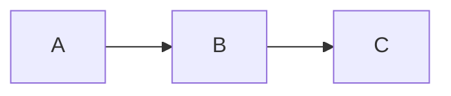

# PKG Development

This document aims to help you get started with `pkg` development.

::: tip Package manager
`pkg` uses **yarn** for development. Run `yarn install` once, then `yarn build` / `yarn lint` / `yarn test:22` for everyday tasks. `npm` is only used inside `docs-site/` — never at the repo root, since that would create a spurious `package-lock.json`.
:::

## Release Process

To create a release, just run:

```bash
yarn release
```

This command starts an interactive process that guides you through the release using [release-it](https://github.com/release-it/release-it).

## Testing

`pkg` has two test suites:

1. **Unit suite** (`test/unit/*.test.ts`) — in-process assertions using Node's built-in [`node:test`](https://nodejs.org/api/test.html) runner. Imports `lib/*.ts` directly via `esbuild-register`, so no `yarn build` is required. Runs in ~1 second.
2. **E2E suite** (`test/test-XX-*/`) — each directory spawns the `pkg` CLI and asserts on the produced binaries. Requires a prior `yarn build`.

### Unit suite

```bash
yarn test:unit          # run once
yarn test:unit:watch    # re-run on change
```

### E2E suite

Before running e2e tests, ensure you have built the project by running:

```bash
yarn build
```

> [!NOTE]
> Remember to run again `yarn build` after changing source code (everything inside `lib` folder).

Then you can use the following command to run tests:

```bash
node test/test.js <target> [no-npm | only-npm | all] [<flavor>]
```

- `<target>` is the node target the test will use when creating executables, can be `nodeXX` (like `node20`) or `host` (uses host node version as target).
- `[no-npm | only-npm | all]` to specify which tests to run. `no-npm` will run tests that don't require npm, `only-npm` will run against some specific npm modules, and `all` will run all tests.
- `<flavor>` to use when you want to run only tests matching a specific pattern. Example: `node test/test.js all test-99-*`. You can also set this by using `FLAVOR` environment variable.

Each e2e test is located inside `test` directory into a dedicated folder named following the pattern `test-XX-*`. The `XX` is a number that represents the order the tests will run.

When running `node test/test.js all`, based on the options, each test will be run consecutively by running `main.js` file inside the test folder.

### Coverage

`pkg` uses [c8](https://github.com/bcoe/c8) as a thin reporter over V8's built-in coverage. `NODE_V8_COVERAGE` propagates through child processes, so e2e coverage captures the `pkg` CLI executions spawned by the harness.

```bash
# Run unit coverage alone — always deterministic; clears coverage/tmp first.
yarn coverage:unit

# Append e2e coverage on top of whatever is in coverage/tmp (uses `c8 --clean=false`).
# After a fresh `yarn coverage:unit`, this produces a merged report. Without
# a prior run it produces an e2e-only report. For a guaranteed e2e-only view,
# delete `coverage/` first. (Slow — runs the full e2e matrix.)
yarn coverage:e2e

# Full merged report: cleans, runs unit, then appends e2e, then emits lcov+text.
yarn coverage
```

### Example e2e test

Create a directory named `test-XX-<name>` and inside it create a `main.js` file with the following content:

```javascript
#!/usr/bin/env node

'use strict';

const assert = require('assert');
const utils = require('../utils.js');

assert(!module.parent);
assert(__dirname === process.cwd());

const input = './test-x-index';

const newcomers = [
  'test-x-index-linux',
  'test-x-index-macos',
  'test-x-index-win.exe',
];

const before = utils.filesBefore(newcomers);

utils.pkg.sync([input], { stdio: 'inherit' });

utils.filesAfter(before, newcomers);
```

Explaining the code above:

- `assert(!module.parent);` ensures the script is being run directly.
- `assert(__dirname === process.cwd());` ensures the script is being run from the correct directory.
- `utils.filesBefore(newcomers);` get current files in the directory.
- `utils.pkg.sync([input], { stdio: 'inherit' });` runs `pkg` passing input file as only argument.
- `utils.filesAfter(before, newcomers);` checks if the output files were created correctly and cleans up the directory to the original state.

### Special tests

- `test-79-npm`: the only test run when using `only-npm`. It installs and tests all Node modules listed inside that directory and verifies they work correctly.
- `test-42-fetch-all`: for each known Node version, verifies a patch exists for it using pkg-fetch.
- `test-46-multi-arch`: Tries to cross-compile a binary for all known architectures.

## Hacking on this docs site

The documentation you're reading lives under `docs-site/` and is built with [VitePress](https://vitepress.dev). It's a separate package with its own `package.json` and `package-lock.json` — this is the **only** place `npm` is used in the repo; `pkg` itself uses `yarn`.

```bash
cd docs-site
npm install           # first time only
npm run docs:dev      # hot-reload dev server on http://localhost:5173/pkg/
```

Build a production snapshot and preview it:

```bash
npm run docs:build    # outputs to .vitepress/dist
npm run docs:preview
```

### Structure

- `docs-site/index.md` — landing page (home layout)
- `docs-site/guide/*.md` — user guide
- `docs-site/architecture.md` — architecture deep-dive
- `docs-site/development.md` — this page
- `docs-site/.vitepress/config.ts` — sidebar, nav, mermaid config, version injection
- `docs-site/.vitepress/theme/custom.css` — pkg brand palette + overrides

Each content page should start with frontmatter providing a `title` and `description` — they feed the `<title>`/`<meta description>` tags and improve search indexing.

### Mermaid diagrams

Mermaid is wired via [`vitepress-plugin-mermaid`](https://www.npmjs.com/package/vitepress-plugin-mermaid). Use fenced blocks with the `mermaid` language:

````md

````

### Adding a new page

1. Create the markdown file with frontmatter (`title`, `description`)
2. Add a sidebar entry in `docs-site/.vitepress/config.ts` under the appropriate group
3. Link to it from related pages so it's discoverable by navigation, not just the sidebar
4. Run `npm run docs:build` — VitePress fails the build on dead links, so any typos surface immediately

### Canonical sources

Two repo-root files are now **stubs** that point at their docs-site counterparts:

- `DEVELOPMENT.md` → `docs-site/development.md`
- `docs/ARCHITECTURE.md` → `docs-site/architecture.md`

Never edit the stubs — edit the `docs-site/` versions. The stubs exist only for GitHub repo browsers that land on the root `.md` files.

### CI

`.github/workflows/docs.yml` runs the VitePress build on every PR that touches `docs-site/**` and deploys to GitHub Pages on every push to `main`. If your PR breaks the docs build, CI will flag it before merge.
