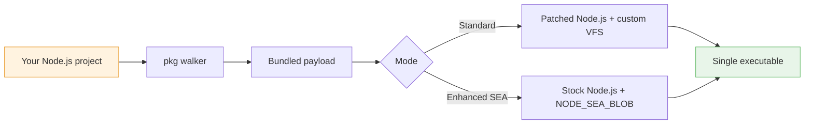

# What is pkg?

`pkg` is a command-line tool that packages your Node.js project into a **single self-contained executable**. The resulting binary runs on devices that don't have Node.js installed, ship no `node_modules`, and boot like any other native CLI tool.

This is **`yao-pkg/pkg`** — the actively maintained fork of the archived `vercel/pkg`.

## Use cases

- Make a commercial version of your application without sources
- Make a demo, evaluation, or trial version of your app without sources
- Instantly make executables for other platforms (cross-compilation)
- Make a self-extracting archive or installer
- Skip installing Node.js and npm on the deployment target
- Deploy a single file instead of hundreds of `npm install` artifacts
- Put your assets inside the executable to make it even more portable
- Test your app against a new Node.js version without installing it

## Two packaging modes

`pkg` supports two ways to build your executable:

- **Standard mode** — uses a custom-patched Node.js binary from [`pkg-fetch`](https://github.com/yao-pkg/pkg-fetch). V8 bytecode, compression, and full source protection.
- **SEA mode** — uses **stock, unmodified Node.js** via Node's [Single Executable Applications](https://nodejs.org/api/single-executable-applications.html) API. Faster builds, zero patch maintenance, stays in sync with upstream Node.js.

Standard mode is battle-tested and still required when you need bytecode source protection or compression. **SEA mode is the recommended default for new projects** that don't need those features — it runs on stock Node.js, builds faster, and is where the project is heading. See [SEA vs Standard](/guide/sea-vs-standard) for the full comparison and the roadmap for going patch-free.

## How it works

The walker follows `require` / `import` from your entry file, pulls in every dependency, optionally compiles JavaScript to V8 bytecode (Standard) or keeps source (SEA), and injects the whole bundle into a Node.js binary.

Want the full story? See [Architecture](/architecture).

## Next steps

- [Getting started](/guide/getting-started) — install and build your first binary
- [Targets](/guide/targets) — cross-compile for other platforms
- [Configuration](/guide/configuration) — scripts, assets, and the `pkg` property in `package.json`
- [SEA vs Standard](/guide/sea-vs-standard) — which mode to pick
- [Recipes](/guide/recipes) — copy-paste solutions
- [Migration from vercel/pkg](/guide/migration)
