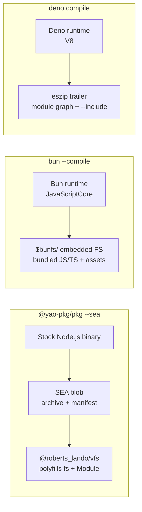

# pkg vs Bun vs Deno

Three tools turn JavaScript into a standalone executable: `@yao-pkg/pkg`, `bun build --compile`, and `deno compile`. Each solves the problem differently — stock Node + VFS, JavaScriptCore + embedded FS, V8 + eszip. This page lays out the trade-offs and runs the same project through all three.

::: tip TL;DR

- **Bun** is the fastest to build and produces the smallest binary, but it targets Node-API addons indirectly (`node-pre-gyp` packages need manual intervention) and runs on JavaScriptCore, not V8.
- **Deno** auto-detects `node_modules`, cross-compiles cleanly, and embeds assets via `--include`, but native addons need `--self-extracting` and a handful of Node built-ins are still stubbed.
- **pkg (SEA)** runs on **stock Node.js** — same V8, same npm, same addon ABI. With `--compress Zstd` or `--compress Brotli` it lands ~20-25% smaller (194 MB → 147–152 MB on claude-code) with no measurable cold-start regression, and it is the only tool here with a path to zero-patch, official Node.js support via [`node:vfs`](https://github.com/nodejs/node/pull/61478).
- **pkg (Standard)** is the only option that can strip source code to V8 bytecode.
  :::

## Feature matrix

| Dimension                            | `@yao-pkg/pkg` (Standard)                                              | `@yao-pkg/pkg` (SEA)                  | `bun build --compile`                                                                     | `deno compile`                                                                             |
| ------------------------------------ | ---------------------------------------------------------------------- | ------------------------------------- | ----------------------------------------------------------------------------------------- | ------------------------------------------------------------------------------------------ |
| **Runtime**                          | Patched Node.js (V8)                                                   | **Stock Node.js** (V8)                | Bun (JavaScriptCore)                                                                      | Deno (V8)                                                                                  |
| **Bundle format**                    | Custom VFS, compressed stripes                                         | Single archive + `@roberts_lando/vfs` | `$bunfs/` embedded FS                                                                     | `eszip` in-memory VFS                                                                      |
| **Cross-compile**                    | ⚠️ Node 22 regression, OK on 20/24                                     | ✅ all targets                        | ✅ all targets (icon/metadata local-only)                                                 | ✅ 5 targets, any host                                                                     |
| **Targets**                          | linux/mac/win × x64/arm64 (+ `linux-arm64-musl` via build-from-source) | Same as Standard                      | linux/mac/win × x64/arm64 + **linux musl** + baseline/modern CPU variants                 | linux/mac/win × x64/arm64 (no musl, no win-arm64)                                          |
| **Native `.node` addons**            | ✅ extracted to `~/.cache/pkg/<hash>/`                                 | ✅ same cache strategy                | ⚠️ direct `require("./x.node")` only — `node-pre-gyp` breaks bundling                     | ⚠️ requires `--self-extracting` for runtime `dlopen`                                       |
| **Bytecode / ahead-of-time compile** | ✅ **V8 bytecode, source-strippable**                                  | ❌ source in plaintext                | ✅ `--bytecode` (JSC, CJS default, ESM since v1.3.9)                                      | ❌ V8 code-cache only                                                                      |
| **Asset embedding**                  | `pkg.assets` glob in `package.json`                                    | `pkg.assets` glob                     | Extra entrypoints + `--asset-naming="[name].[ext]"` or `import ... with { type: "file" }` | `--include path/`                                                                          |
| **npm compatibility**                | Full (it _is_ Node)                                                    | Full (it _is_ Node)                   | High (bundler-hostile patterns break)                                                     | Partial — 22/44 built-ins fully, some stubbed (`node:cluster`, `node:sea`, `node:wasi`, …) |
| **ESM + top-level await**            | ⚠️ ESM → CJS transform can fail on TLA + re-exports                    | ✅ native ESM                         | ✅ native ESM                                                                             | ✅ native ESM (primary)                                                                    |
| **Compression**                      | ✅ Brotli / GZip / Zstd per stripe                                     | ✅ Brotli / GZip / Zstd per stripe    | ❌                                                                                        | ❌                                                                                         |
| **Windows icon / metadata**          | ✅ (via `rcedit` at build)                                             | ✅                                    | ✅ `--windows-icon` + rich metadata _(disabled when cross-compiling)_                     | ✅ `--icon` (cross-compile OK), no version/product fields                                  |
| **Security updates**                 | Wait for `pkg-fetch` to rebase patches and republish                   | **Same day Node.js releases**         | Tied to Bun release cadence                                                               | Tied to Deno release cadence                                                               |
| **License model**                    | MIT — runs stock V8                                                    | MIT — runs stock V8                   | MIT                                                                                       | MIT                                                                                        |

## Architectural difference in one picture



All three produce one binary, expose embedded files to `fs.readFileSync`, and launch in under a second. What differs is whose runtime you are shipping: pkg ships the same Node.js you tested against, while Bun and Deno ship their own runtime and compat layer.

## Native addon support

Most non-trivial Node projects load something through `dlopen`: `better-sqlite3`, `sharp`, `bcrypt`, `canvas`, Prisma's query engine, etc. How each tool handles this is the most common reason a migration stalls.

| Scenario                                                                            | pkg                                                                               | Bun                                                                                                                                                                          | Deno                                                                     |
| ----------------------------------------------------------------------------------- | --------------------------------------------------------------------------------- | ---------------------------------------------------------------------------------------------------------------------------------------------------------------------------- | ------------------------------------------------------------------------ |
| Direct `require("./addon.node")`                                                    | ✅ VFS extracts to `~/.cache/pkg/<sha256>/` on first load, SHA-verified, persists | ✅ documented                                                                                                                                                                | ✅ with `--self-extracting`                                              |
| `node-pre-gyp` / `node-gyp-build` indirection (`sharp`, `better-sqlite3`, `bcrypt`) | ✅ walker detects + bundles                                                       | ⚠️ [docs](https://bun.sh/docs/bundler/executables#embedding-nodejs-addons) say "you'll need to make sure the `.node` file is directly required or it won't bundle correctly" | ⚠️ needs `--self-extracting` to land the `.node` on disk before `dlopen` |
| ABI compatibility                                                                   | Exactly matches the Node version in the binary                                    | JSC's N-API compatibility layer — works for most but not all addons                                                                                                          | Node-API compat layer in Deno 2+                                         |

For packages that use `node-pre-gyp` (a large fraction of native addons), Bun requires you to pin the specific `.node` file and `require` it directly. pkg's walker and Deno's extraction do this transparently.

## Claude Code case study

The last pure-JS release of `@anthropic-ai/claude-code` (v1.0.100) is a good stress test: an ESM-only, 9 MB minified single-file CLI with top-level `await`, `yoga.wasm` loaded at startup via `require.resolve`, a vendored `ripgrep` binary, and `sharp` as an optional native dep.

All numbers on Linux x64, Node 22.22.1, Bun 1.3.12, Deno 2.7.12:

| Command                                                              | Outcome                                                                                                                                              | Binary     | First `--version` |
| -------------------------------------------------------------------- | ---------------------------------------------------------------------------------------------------------------------------------------------------- | ---------- | ----------------- |
| `pkg cli.js -t node22-linux-x64` (Standard)                          | ❌ `Failed to generate V8 bytecode` — top-level await + ESM re-exports block pkg's CJS transform. Warning suggests `--fallback-to-source` or `--sea` | —          | —                 |
| `pkg cli.js --fallback-to-source -t node22-linux-x64` (Standard)     | ❌ Source-as-fallback path still loads as CJS; `ERR_MODULE_NOT_FOUND` at runtime                                                                     | 83 MB      | —                 |
| `pkg . --sea -t node22-linux-x64` (SEA, no `pkg.assets`)             | ❌ Runs, but `Cannot find module './yoga.wasm'` — walker can't see dynamic resolves                                                                  | 134 MB     | —                 |
| `pkg . --sea` with `"pkg": {"assets": ["yoga.wasm","vendor/**/*"]}`  | ✅                                                                                                                                                   | **194 MB** | **560 ms**        |
| `pkg . --sea --compress GZip`                                        | ✅ (same assets config)                                                                                                                              | **154 MB** | 580 ms            |
| `pkg . --sea --compress Zstd`                                        | ✅ (same assets config)                                                                                                                              | **152 MB** | 570 ms            |
| `pkg . --sea --compress Brotli`                                      | ✅ (same assets config, ~3 min build time)                                                                                                           | **147 MB** | 590 ms            |
| `bun build --compile cli.js`                                         | ❌ Runtime: `Cannot find module './yoga.wasm' from '/$bunfs/root/cc-bun'`                                                                            | 108 MB     | —                 |
| `bun build --compile cli.js yoga.wasm --asset-naming="[name].[ext]"` | ✅                                                                                                                                                   | **108 MB** | **510 ms**        |
| `bun build --compile --bytecode --format=esm …` (+ asset flag)       | ✅                                                                                                                                                   | 190 MB     | 530 ms            |
| `bun build --compile --bytecode --minify …`                          | ❌ `Expected ";" but found ")"` — parser regression on the already-minified ESM                                                                      | —          | —                 |
| `deno compile --allow-all --include yoga.wasm cli.js`                | ✅ auto-included the entire `node_modules/`                                                                                                          | **183 MB** | **740 ms**        |

::: tip Cold-start vs binary size
Cold-start overhead from `--compress` is negligible on this workload (+10–30 ms across codecs; lazy per-file decompression means only files the CLI reads pay a decode cost). The win is size: Zstd and Brotli close more than half the gap to Bun's 108 MB binary while keeping stock Node.js semantics.

Brotli compresses hardest but takes ~3 min to build on this archive — a cost paid once at package time. For CI builds, Zstd is the better default.
:::

### Observations

- **No tool "just works."** Every one needs a hint about `yoga.wasm` — the symptoms differ. pkg silently succeeds with a broken binary if you forget `pkg.assets`; Bun silently succeeds but renames the asset unless you pass `--asset-naming`; Deno auto-includes `node_modules`, which inflated the binary to 183 MB.
- **Bun produced the smallest working binary (108 MB) and the fastest cold start (510 ms)** — at the cost of running on JavaScriptCore instead of V8.
- **pkg SEA with `--compress Zstd` lands at 152 MB** (down from 194 MB uncompressed) with no measurable cold-start regression. Per-file lazy decompression means files the CLI never touches never pay a decode cost. Brotli pushes size to 147 MB at the cost of a ~3 minute one-time build.
- **The remaining ~40 MB gap to Bun is the Node.js binary itself.** `pkg-fetch` ships stock Node with full-ICU (~30 MB of locale data) plus `inspector`, `npm`, and `corepack`. A Node built with `./configure --without-intl --without-inspector --without-npm --without-corepack --fully-static` drops the base from ~70 MB to ~40 MB — putting a Brotli-compressed SEA binary of claude-code near ~115 MB, within 10 MB of Bun. This is a `pkg-fetch` change tracked as follow-up in #250.
- **Bun's `--bytecode` nearly doubled the binary (190 MB) without improving startup** for this async-heavy CLI. The Bun docs warn bytecode output can be ~8× larger per module and skips async/generator/eval, matching what we saw.
- **pkg Standard is the wrong choice for ESM-first apps with top-level await.** Use `--sea` — this is why SEA mode exists and is the [recommended default](/guide/sea-vs-standard#when-to-pick-which).
- **Deno's ~740 ms cold start vs ~550 ms for pkg/Bun** comes from permission-system init and Node compat boot; source is still parsed at launch (no ahead-of-time V8 snapshot).

### Hello-world baseline for reference

Same build machine, same Linux x64 target, trivial `console.log` script:

| Tool            | Binary | Best of 5 startup |
| --------------- | ------ | ----------------- |
| `pkg` Standard  | 71 MB  | 40 ms             |
| `pkg` SEA       | 119 MB | 60 ms             |
| Bun `--compile` | 96 MB  | 10 ms             |
| Deno `compile`  | 93 MB  | 50 ms             |

## Cross-compilation

All three can build Linux / macOS / Windows × x64 / arm64 from any host. The edges differ:

- **Bun** supports the widest target list — including `bun-linux-x64-musl`, `bun-linux-arm64-musl`, and CPU-tier splits (`baseline` for pre-2013 chips, `modern` for Haswell+). Windows icon / version / metadata flags are [disabled when cross-compiling](https://bun.sh/docs/bundler/executables).
- **Deno** supports 5 targets (`x86_64-unknown-linux-gnu`, `aarch64-unknown-linux-gnu`, `x86_64-apple-darwin`, `aarch64-apple-darwin`, `x86_64-pc-windows-msvc`) — no musl target, no Windows arm64.
- **pkg** cross-compiles cleanly in SEA mode on Node 20 and Node 24. Node 22 Standard mode has a [known regression](/guide/targets#cross-compilation-support).

## Bytecode / source protection

The only tool that can **strip source code from the binary** is `@yao-pkg/pkg` in Standard mode. The fabricator compiles JS to V8 bytecode, stores it as `STORE_BLOB` with `sourceless: true`, and throws the source away — a byte dump of the executable contains bytecode only. See [Bytecode](/guide/bytecode).

Everything else stores source:

- **pkg SEA** stores JS source in the archive (SEA has no `sourceless` equivalent yet).
- **Bun `--bytecode`** emits `.jsc` alongside `.js` — the `.js` fallback stays because bytecode can't represent async/generator/eval bodies.
- **Deno** compiles at runtime; source is embedded in the eszip.

If source protection is a hard requirement, pkg Standard is the only option. For everything else, obfuscate first and accept that "compiled" ≠ "secret."

## When to pick which

- **You need source protection** → `pkg` Standard (V8 bytecode with source stripping).
- **You're on stock Node.js and want security fixes the day Node releases them** → `pkg --sea`.
- **You want the smallest binary and fastest cold start, your stack is all-ESM, no `node-pre-gyp` addons, and JavaScriptCore's npm compat matrix covers your deps** → `bun build --compile`.
- **You're writing a Deno-first app that also uses some `npm:` specifiers** → `deno compile`.
- **You have `sharp` / `better-sqlite3` / `bcrypt` / anything via `node-pre-gyp`** → `pkg` (either mode) — no flag gymnastics, no first-run extraction tax.
- **You need musl / Alpine** → `pkg` (via [`linux-arm64-musl` build from source](/guide/targets)) or `bun` (`bun-linux-x64-musl`, `bun-linux-arm64-musl`).

## Summary

Each tool owns a different lane:

- **Bun** — smallest binary (108 MB), fastest cold start (510 ms), and the widest target list (musl + baseline/modern CPU variants). Best for greenfield CLIs with no `node-pre-gyp` addons. Trade: JavaScriptCore instead of V8 and bundler-hostile footguns.
- **Deno** — lowest-effort build in the matrix thanks to `--include` and automatic `node_modules` detection. Best fit for Deno-first projects, not as a drop-in for existing Node apps. Slowest cold start (740 ms) and a handful of stubbed Node built-ins (`node:cluster`, `node:sea`, `node:wasi`).
- **`pkg --sea`** — runs the stock Node binary you tested against: same V8, same N-API ABI, same npm semantics. `node-pre-gyp` addons (`sharp`, `better-sqlite3`, `bcrypt`) bundle transparently. Per-file Brotli/GZip/Zstd closes most of the size gap with Bun. Ships Node CVE fixes the same day Node releases them.
- **`pkg` Standard** — the only option that ships the binary without recoverable source code, via V8 bytecode with `sourceless: true`. Required if IP protection is a hard constraint.

For a production Node.js app: **`pkg --sea`** is the safest default. Not for performance or size — Bun wins those — but because you are not swapping runtimes.

## What these claims don't prove

### "V8 beats JavaScriptCore"

We don't make that claim. JavaScriptCore ships in Safari, powers billions of devices, and often wins specific benchmarks against V8. The argument for V8 here isn't "faster" — it's "identical to what you tested":

- npm packages are tested under V8/Node. Running them on JSC means trusting Bun's Node-API and built-in compat layers. Those layers are well-maintained but have gaps you only discover at runtime.
- V8-specific behaviours (stack trace formatting, `Error.prepareStackTrace`, `%Opt` natives, `--max-old-space-size` semantics, async-hook timings) sometimes leak into production code via observability and framework internals. They surface on the engine swap.

This is a compatibility-risk axis, not an engine-quality one. On a greenfield codebase where you control every dep, the argument evaporates.

### "Bytecode protects your source"

V8 bytecode is a serialization format with public decompilers ([`bytenode`](https://github.com/bytenode/bytenode), `v8-decompile-bytecode`, research tools). It raises the bar past `strings(1)`, but a determined reverse engineer will recover readable JS. Treat `pkg` Standard's source-stripping as a speed bump. Real IP protection needs obfuscation + licensing + server-side secrets — none of these tools solve that.

### "pkg Standard ships stock Node.js"

Only `pkg --sea` ships stock Node.js. Standard mode ships a patched Node.js distributed through `pkg-fetch` (~600–850 lines of patches per release). That is why SEA mode exists.

### "The claude-code numbers prove Bun is faster / smaller"

n=1 on a single package on a single Linux x64 host. The conclusion scales narrowly:

- claude-code's `cli.js` is already a single pre-bundled file, so Bun's bundler has little to do. Projects with a sprawling dep graph and dynamic `require` will look different.
- Deno's 740 ms cold start includes permission-system init and Node compat boot; amortized to zero for long-running servers. Cold start matters for CLIs, not servers.
- pkg SEA's 194 MB baseline was uncompressed. With `--compress Zstd` the binary drops to 152 MB (archive 77.5 → 33.9 MB), with `--compress Brotli` to 147 MB (77.5 → 28.3 MB). The remaining ~40 MB gap to Bun is the Node binary and metadata. A trimmed Node build (`./configure --without-intl --without-inspector --without-npm --without-corepack --fully-static`) would drop ~30 MB of ICU locale data plus a few more MB, bringing a Brotli SEA binary to ~115 MB. Tracked in #250. Standard mode with Brotli would also be smaller, but Standard couldn't build this package at all — so the comparison is apples-to-oranges.
- Bun's `--bytecode` doubled the binary on this workload because async-heavy ESM with generator / `eval` sites falls back to shipping source alongside bytecode. A synchronous CJS-heavy app would see a smaller delta.

Treat the matrix as one realistic data point, not a benchmark.

### "You get Node security fixes the day they ship"

True for `pkg --sea` — it downloads the released Node binary from the Node.js project. False for `pkg` Standard — you wait for `pkg-fetch` to rebase the patch stack. Also false for Bun and Deno — you wait for their maintainers to pick up the V8/JSC fix and cut a release.

### "Bun and Deno can't bundle `sharp` / `better-sqlite3`"

Both can, with extra steps. Bun requires the `.node` file to be required directly; Deno needs `--self-extracting` so the addon lands on disk before `dlopen`. For a handful of addons you control, both work. pkg's advantage is that the walker detects `node-pre-gyp` packages automatically without per-addon configuration.

### Rule of thumb

Pick on what you'll regret later, not on benchmark deltas:

- Regret running on a non-V8 engine? → pkg
- Regret your binary being 80 MB heavier than it needed to be? → Bun
- Regret that new Node CVEs take a week to land? → pkg SEA
- Regret that your source is shippable with `strings(1)`? → pkg Standard (plus obfuscation)

## Reproducing the numbers

```sh
# Install toolchain
npm install -g @yao-pkg/pkg
curl -fsSL https://bun.sh/install | bash
curl -fsSL https://github.com/denoland/deno/releases/latest/download/deno-x86_64-unknown-linux-gnu.zip \
  -o /tmp/deno.zip && unzip /tmp/deno.zip -d ~/.deno/bin/

# Test project
mkdir cc-test && cd cc-test && npm init -y
npm install --ignore-scripts @anthropic-ai/claude-code@1.0.100

# Build (pkg SEA — needs pkg.assets config; see Detecting assets)
node -e 'const p=require("./node_modules/@anthropic-ai/claude-code/package.json"); \
  p.pkg={assets:["yoga.wasm","vendor/**/*"]}; \
  require("fs").writeFileSync("node_modules/@anthropic-ai/claude-code/package.json", JSON.stringify(p,null,2))'
pkg ./node_modules/@anthropic-ai/claude-code --sea -t node22-linux-x64 -o cc-pkg

# Build (pkg SEA with per-file Zstd compression — 152 MB binary)
pkg ./node_modules/@anthropic-ai/claude-code --sea --compress Zstd \
  -t node22-linux-x64 -o cc-pkg-zstd

# Build (bun)
bun build --compile --asset-naming="[name].[ext]" \
  node_modules/@anthropic-ai/claude-code/cli.js \
  node_modules/@anthropic-ai/claude-code/yoga.wasm \
  --outfile cc-bun

# Build (deno)
deno compile --allow-all \
  --include node_modules/@anthropic-ai/claude-code/yoga.wasm \
  --output cc-deno \
  node_modules/@anthropic-ai/claude-code/cli.js
```

## Further reading

- [pkg Architecture](/architecture) — Standard vs SEA internals
- [pkg SEA vs Standard](/guide/sea-vs-standard) — when to pick which pkg mode
- [Detecting assets](/guide/detecting-assets) — why the walker misses dynamic paths and how `pkg.assets` fixes it
- [Bun — Single-file executable](https://bun.sh/docs/bundler/executables)
- [Deno — `deno compile`](https://docs.deno.com/runtime/reference/cli/compile/)
- [`node:vfs` — the future of SEA asset embedding](https://github.com/nodejs/node/pull/61478)
