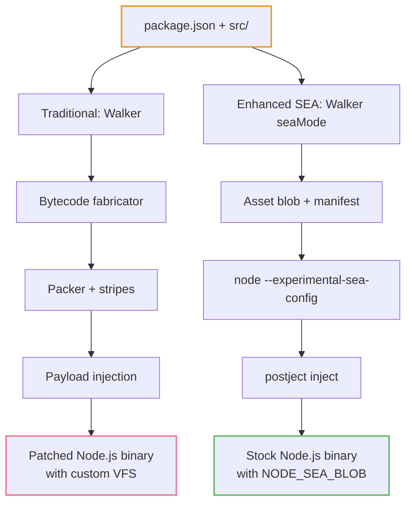
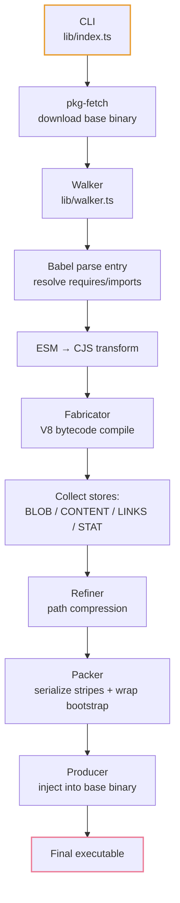
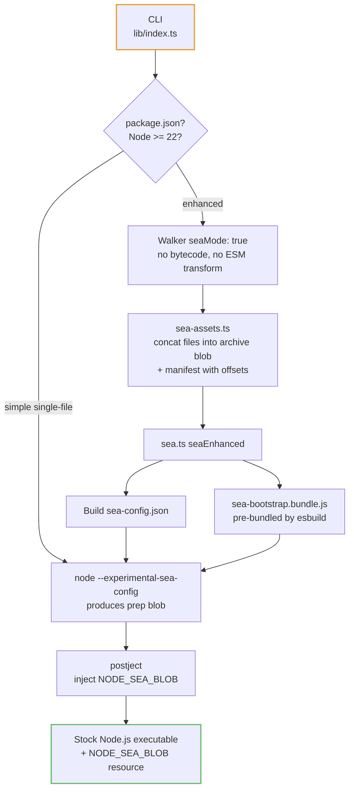
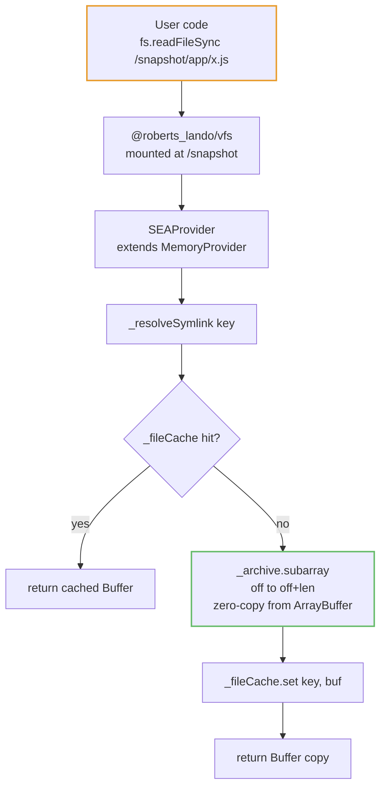

# pkg Architecture: Traditional Mode vs Enhanced SEA Mode

This document describes how `pkg` packages Node.js applications into standalone executables, covering both the traditional binary-patching approach and the new SEA (Single Executable Application) mode with VFS support.

## Visual overview

Both modes start from the same project and end with a single executable, but they take very different paths through the build pipeline:



## Table of Contents

- [Overview](#overview)
- [Traditional Mode](#traditional-mode)
  - [Build Pipeline](#build-pipeline)
  - [Binary Format](#binary-format)
  - [Runtime Bootstrap](#runtime-bootstrap)
- [Enhanced SEA Mode](#enhanced-sea-mode)
  - [Build Pipeline](#sea-build-pipeline)
  - [Binary Format](#sea-binary-format)
  - [Runtime Bootstrap](#sea-runtime-bootstrap)
  - [VFS Provider Architecture](#vfs-provider-architecture)
  - [Worker Thread Support](#worker-thread-support)
- [Shared Runtime Code](#shared-runtime-code)
- [Performance Comparison](#performance-comparison)
- [Code Protection Comparison](#code-protection-comparison)
- [When to Use Each Mode](#when-to-use-each-mode)
- [Node.js Ecosystem Dependencies](#nodejs-ecosystem-dependencies)

---

## Overview

`pkg` supports two packaging strategies, selected via the `--sea` flag:

```
pkg .                          # Traditional mode (default)
pkg . --sea                    # Enhanced SEA mode (Node >= 22 with package.json)
pkg single-file.js --sea       # Simple SEA mode (any single .js file)
```

| Aspect        | Traditional          | Enhanced SEA        | Simple SEA          |
| ------------- | -------------------- | ------------------- | ------------------- |
| Walker        | Yes                  | Yes (seaMode)       | No                  |
| VFS           | Custom binary format | @roberts_lando/vfs  | None                |
| Bytecode      | V8 compiled          | No (source as-is)   | No                  |
| ESM transform | ESM to CJS           | No (native ESM)     | No                  |
| Node.js API   | Binary patching      | Official `node:sea` | Official `node:sea` |
| Min Node      | 22 (pkg runtime)     | 22 (target)         | 22 (target)         |

---

## Traditional Mode

### Build Pipeline



Detailed pipeline:

```
CLI (lib/index.ts)
  │
  ├─ Parse targets (node22-linux-x64, etc.)
  ├─ Fetch pre-compiled Node.js binaries (via @yao-pkg/pkg-fetch)
  │
  ├─ Walker (lib/walker.ts)
  │   ├─ Parse entry file with Babel → find require/import calls
  │   ├─ Recursively resolve dependencies (lib/follow.ts, lib/resolver.ts)
  │   ├─ Transform ESM → CJS (lib/esm-transformer.ts)
  │   ├─ Compile JS to V8 bytecode via fabricator (lib/fabricator.ts)
  │   └─ Collect: STORE_BLOB, STORE_CONTENT, STORE_LINKS, STORE_STAT
  │
  ├─ Refiner (lib/refiner.ts)
  │   ├─ Purge empty top-level directories
  │   └─ Denominate paths (strip common prefix)
  │
  ├─ Packer (lib/packer.ts)
  │   ├─ Serialize file records into "stripes" (snap path + store + data)
  │   ├─ Wrap bootstrap.js with injected parameters:
  │   │     REQUIRE_COMMON, REQUIRE_SHARED, VIRTUAL_FILESYSTEM,
  │   │     DEFAULT_ENTRYPOINT, SYMLINKS, DICT, DOCOMPRESS
  │   └─ Return { prelude, entrypoint, stripes }
  │
  └─ Producer (lib/producer.ts)
      ├─ Open Node.js binary
      ├─ Find placeholders (PAYLOAD_POSITION, PAYLOAD_SIZE, BAKERY, etc.)
      ├─ Stream stripes into payload section
      ├─ Apply compression (Brotli/GZip) per stripe
      ├─ Build VFS dictionary for path compression
      ├─ Inject byte offsets into placeholders
      └─ Write final executable
```

### Binary Format

The traditional executable has this layout:

```
┌────────────────────────────────┐
│ Node.js binary (unmodified)    │  ← Original executable
│ with placeholder markers:      │
│   // BAKERY //                 │  ← Node.js CLI options
│   // PAYLOAD_POSITION //       │  ← Byte offset of payload
│   // PAYLOAD_SIZE //           │  ← Byte length of payload
│   // PRELUDE_POSITION //       │  ← Byte offset of prelude
│   // PRELUDE_SIZE //           │  ← Byte length of prelude
├────────────────────────────────┤
│ Payload section:               │
│   ┌────────────────────────┐   │
│   │ Prelude (bootstrap.js) │   │  ← Runtime bootstrap code
│   ├────────────────────────┤   │
│   │ Stripe: /app/index.js  │   │  ← V8 bytecode (STORE_BLOB)
│   │ Stripe: /app/lib.js    │   │  ← Source code (STORE_CONTENT)
│   │ Stripe: /app/data.json │   │  ← Asset content
│   │ Stripe: /app/          │   │  ← Dir listing (STORE_LINKS)
│   │ ...                    │   │
│   ├────────────────────────┤   │
│   │ VFS dictionary (JSON)  │   │  ← Maps paths → [offset, size]
│   └────────────────────────┘   │
└────────────────────────────────┘
```

Each file is stored with one or more store types:

| Store           | Value | Content           | Purpose                                         |
| --------------- | ----- | ----------------- | ----------------------------------------------- |
| `STORE_BLOB`    | 0     | V8 bytecode       | Compiled JS (source can be stripped)            |
| `STORE_CONTENT` | 1     | Raw source/binary | JS source, JSON, assets, .node files            |
| `STORE_LINKS`   | 2     | JSON array        | Directory entry names for `readdir`             |
| `STORE_STAT`    | 3     | JSON object       | File metadata (size, mode, isFile, isDirectory) |

### Runtime Bootstrap

`prelude/bootstrap.js` (1970 lines) executes before user code. It:

1. **Sets up entrypoint** — Reads `DEFAULT_ENTRYPOINT` from injected parameters, sets `process.argv[1]`
2. **Initializes VFS** — Builds in-memory lookup from `VIRTUAL_FILESYSTEM` dictionary with optional path compression via `DICT`
3. **Patches `fs` module** — Intercepts 20+ `fs` functions (`readFileSync`, `readFile`, `statSync`, `stat`, `readdirSync`, `readdir`, `existsSync`, `exists`, `accessSync`, `access`, `realpathSync`, `realpath`, `createReadStream`, `open`, `read`, `close`, etc.). Each patched function checks if the path is inside `/snapshot/` — if yes, reads from the VFS payload; if no, falls through to the real `fs`
4. **Patches `Module` system** — Custom `_resolveFilename` and `_compile` that load modules from the VFS. Bytecode modules are executed via `vm.Script` with `cachedData` (the V8 bytecode) and `sourceless: true`
5. **Patches `child_process`** — Via `REQUIRE_SHARED.patchChildProcess()`. Rewrites spawn/exec calls so that spawning `node` or the entrypoint correctly uses `process.execPath`
6. **Patches `process.dlopen`** — Via `REQUIRE_SHARED.patchDlopen()`. Extracts `.node` files from VFS to `~/.cache/pkg/<sha256>/` before loading
7. **Sets up `process.pkg`** — Via `REQUIRE_SHARED.setupProcessPkg()`. Provides `process.pkg.entrypoint`, `process.pkg.path.resolve()`, `process.pkg.mount()`

The payload is read at runtime via file descriptor operations on the executable itself:

```javascript
// bootstrap.js — reads payload from the running executable
fs.readSync(EXECPATH_FD, buffer, offset, length, PAYLOAD_POSITION + position);
```

---

## Enhanced SEA Mode

### SEA Build Pipeline



Detailed pipeline:

```
CLI (lib/index.ts)
  │
  ├─ Detect: has package.json + target Node >= 22 → enhanced mode
  │
  ├─ Walker (lib/walker.ts, seaMode: true)
  │   ├─ Parse entry file with Babel → find require/import calls
  │   ├─ Recursively resolve dependencies
  │   ├─ SKIP: ESM → CJS transformation (files stay native ESM)
  │   ├─ SKIP: V8 bytecode compilation (no fabricator)
  │   └─ Collect: STORE_CONTENT only (+ STORE_LINKS, STORE_STAT)
  │
  ├─ Refiner (lib/refiner.ts)
  │   └─ Same as traditional (path compression, empty dir pruning)
  │
  ├─ SEA Asset Generator (lib/sea-assets.ts)
  │   ├─ Concatenate all STORE_CONTENT files into a single __pkg_archive__ blob
  │   ├─ Build __pkg_manifest__.json:
  │   │     { entrypoint, directories, stats, symlinks, offsets }
  │   │     offsets maps key → [byteOffset, byteLength] into the archive
  │   └─ Write archive + manifest to temp dir
  │
  └─ SEA Orchestrator (lib/sea.ts → seaEnhanced())
      ├─ Reject useSnapshot:true (incompatible with the VFS bootstrap)
      ├─ Copy pre-bundled sea-bootstrap.bundle.js to tmpDir
      │     (built by scripts/build-sea-bootstrap.js — 2-step esbuild:
      │      1. Bundle sea-worker-entry.js → string module
      │      2. Bundle sea-bootstrap.js + VFS + worker string → bundle)
      ├─ Build sea-config.json:
      │     { main, output, useCodeCache, useSnapshot:false,
      │       assets: { __pkg_manifest__, __pkg_archive__ } }
      ├─ Pick blob generator binary (host/target major):
      │     host major === target major → process.execPath
      │     otherwise                    → downloaded target binary
      ├─ Generate blob:
      │     node --experimental-sea-config sea-config.json
      │     (--build-sea is intentionally NOT used — it produces a
      │      finished executable and bypasses the prep-blob + postject
      │      flow that pkg needs for multi-target injection)
      ├─ For each target:
      │     1. Download Node.js binary (getNodejsExecutable)
      │     2. Inject blob via postject (bake)
      │     3. Sign macOS if needed (signMacOSIfNeeded)
      └─ Cleanup tmpDir
```

### SEA Binary Format

The SEA executable uses the official Node.js resource format:

```
┌──────────────────────────────────┐
│ Node.js binary                   │
│ with NODE_SEA_FUSE activated     │  ← Sentinel fuse flipped
├──────────────────────────────────┤
│ NODE_SEA_BLOB resource:          │  ← Injected via postject
│   ┌──────────────────────────┐   │
│   │ main: sea-bootstrap.js   │   │  ← Bundled bootstrap + VFS polyfill
│   ├──────────────────────────┤   │
│   │ Asset: __pkg_manifest__  │   │  ← JSON: dirs, stats, symlinks, offsets
│   ├──────────────────────────┤   │
│   │ Asset: __pkg_archive__   │   │  ← Single binary blob containing ALL files
│   │   ┌──────────────────┐   │   │
│   │   │ /app/index.js    │   │   │  ← offset=0, length=1234
│   │   │ /app/config.json │   │   │  ← offset=1234, length=567
│   │   │ /app/lib/util.js │   │   │  ← offset=1801, length=890
│   │   │ ...              │   │   │
│   │   └──────────────────┘   │   │
│   └──────────────────────────┘   │
└──────────────────────────────────┘
```

Files are sorted by key and concatenated into the archive. The manifest's `offsets` map (`key → [byteOffset, byteLength]`) enables zero-copy extraction via `Buffer.subarray()`.

The resource is embedded using OS-native formats:

- **Linux**: ELF notes section
- **Windows**: PE `.rsrc` section
- **macOS**: Mach-O `NODE_SEA` segment

### SEA Runtime Bootstrap

The SEA bootstrap is a shared core plus a single CJS wrapper, both bundled by esbuild into `sea-bootstrap.bundle.js`. There is no longer a separate ESM wrapper — native ESM SEA main (`mainFormat: "module"`) is not used because, on Node 25.5+, the embedder `importModuleDynamicallyForEmbedder` callback only resolves builtin modules, so the wrapper cannot dynamically import the user entrypoint from a native-ESM main ([nodejs/node#62726](https://github.com/nodejs/node/issues/62726)). The CJS wrapper handles every entry format including ESM with top-level await.

- **`prelude/sea-bootstrap-core.js`** — Shared setup: VFS mount, shared patches, worker thread interception, diagnostics, `process.argv[1]` prep. Exports `{ manifest, entrypoint, perf }`. No entry execution — the wrapper decides how to run the entrypoint
- **`prelude/sea-bootstrap.js`** — CJS wrapper. Requires the core, then dispatches based on `manifest.entryIsESM`:
  - **CJS entry** → `Module.runMain()` (goes through the real CJS loader; `require(esm)` on Node 22.12+ transparently handles trivial ESM entries)
  - **ESM entry** → compiles a one-liner `import("file:///path/to/entry")` via `vm.Script` with `importModuleDynamically: vm.constants.USE_MAIN_CONTEXT_DEFAULT_LOADER`. Dynamic `import()` inside that script is routed to the **default** ESM loader rather than the embedder callback, so file URLs resolve and top-level await in the user entry works. The `ExperimentalWarning` for `USE_MAIN_CONTEXT_DEFAULT_LOADER` is filtered out via a `process.emitWarning` shim so it doesn't leak into packaged-app stderr
- **`prelude/sea-vfs-setup.js`** — VFS core module consumed by `sea-bootstrap-core.js`: manifest parsing, `SEAProvider` class, archive loading, VFS mount, Windows path normalization. Shared by main thread and worker threads

**Top-level await (TLA):** ESM entrypoints with TLA work on every supported target (Node ≥ 22) via the `vm.Script` + `USE_MAIN_CONTEXT_DEFAULT_LOADER` path. There is no Node-version split and no build-time warning — the CJS `Module.runMain()` path is reserved for CJS entries only, so the `ERR_REQUIRE_ASYNC_MODULE` constraint that blocks `require(esm-with-TLA)` never applies to the main module. `perf.finalize()` runs in the dispatcher's `finally` block so module-loading timings reflect the real entrypoint completion (including async / TLA apps) and still print when the entry throws. Errors on the ESM path set `process.exitCode = 1` instead of calling `process.exit()` so the `finally` runs.

**`useSnapshot` is unsupported** in enhanced SEA mode: SEA's snapshot mode runs the main script at build time inside a V8 startup snapshot context and expects the runtime entry to be registered via `v8.startupSnapshot.setDeserializeMainFunction()`. The pkg bootstrap doesn't do that, and at build time `sea.getRawAsset('__pkg_archive__')` does not exist yet, so snapshot construction would fail outright. An explicit `seaConfig.useSnapshot: true` throws; the sea-config is emitted with `useSnapshot: false` as a defensive default. `useCodeCache` is still forwarded — it only caches V8 bytecode for the bootstrap script and doesn't touch the runtime VFS path.

Execution flow (main thread):

1. **VFS setup** (via `require('./sea-vfs-setup')`) — Loads manifest from `sea.getAsset('__pkg_manifest__', 'utf8')`, creates `SEAProvider` (extends `MemoryProvider`), loads `__pkg_archive__` blob, mounts at `/snapshot`. On Windows, patches `VirtualFileSystem.prototype.shouldHandle` and `resolvePath` to convert backslashes to POSIX
2. **Apply shared patches** — Calls `patchDlopen()`, `patchChildProcess()`, `setupProcessPkg()` from `bootstrap-shared.js`
3. **Diagnostics** — If `manifest.debug` is set (built with `--debug`), calls `installDiagnostic()`
4. **Patch Worker threads** — Wraps `workerThreads.Worker` so workers spawned with `/snapshot/...` paths get the same VFS setup (see [Worker Thread Support](#worker-thread-support))
5. **Start `module loading` perf phase**, set `process.argv[1]`, clear `Module._cache`
6. **Run entrypoint** — The CJS wrapper picks `Module.runMain()` (CJS) or the `vm.Script` dispatcher (ESM). `perf.finalize()` runs in the dispatcher `finally`

The VFS polyfill (`@roberts_lando/vfs`) handles all `fs` and `fs/promises` patching automatically when `mount()` is called — intercepting 164+ functions including `readFile`, `readFileSync`, `stat`, `readdir`, `access`, `realpath`, `createReadStream`, `watch`, `open`, and their promise-based equivalents. It also hooks into the Node.js module resolution system for `require()` and `import`.

**Windows path strategy:** The VFS always mounts at `/snapshot` (POSIX). On Windows, `sea-vfs-setup.js` patches `VirtualFileSystem.prototype.shouldHandle` and `resolvePath` to strip drive letters and convert `\` to `/` before the VFS processes them. The `insideSnapshot()` helper checks for `/snapshot`, `V:\snapshot` (sentinel drive used by `@roberts_lando/vfs` module hooks), and `C:\snapshot` (used by dlopen/child_process).

### VFS Provider Architecture



ASCII version:

```
┌─────────────────────────────────────────────────┐
│ User code: fs.readFileSync('/snapshot/app/x.js') │
└──────────────────────┬──────────────────────────┘
                       │
         ┌─────────────▼──────────────┐
         │ @roberts_lando/vfs          │
         │ (mounted at /snapshot,     │
         │  overlay: true)            │
         │                            │
         │ Strips prefix: /app/x.js   │
         │ Calls provider method      │
         └─────────────┬──────────────┘
                       │
         ┌─────────────▼──────────────────────┐
         │ SEAProvider                         │
         │ extends MemoryProvider              │
         │ (defined in sea-vfs-setup.js)       │
         │                                     │
         │ readFileSync('/app/x.js')           │
         │   → _resolveSymlink(key)            │
         │   → _fileCache.get(key)             │  ← Map cache (fast path)
         │   → _archive.subarray(off, off+len) │  ← Zero-copy from archive
         │   → _fileCache.set(key, buf)        │  ← Cache for next access
         │   → return Buffer copy              │  ← Copy to prevent mutation
         └─────────────────────────────────────┘
```

The `SEAProvider` (in `prelude/sea-vfs-setup.js`) implements lazy loading from a single archive blob:

| Method                     | Behavior                                                                      |
| -------------------------- | ----------------------------------------------------------------------------- |
| `readFileSync(path)`       | Resolve symlinks, `subarray()` from archive via `offsets` map, cache in `Map` |
| `statSync(path)`           | Return metadata from manifest `stats`                                         |
| `internalModuleStat(path)` | Fast path for module resolution: returns 0 (file), 1 (dir), or -2 (not found) |
| `readdirSync(path)`        | Return directory entries from manifest `directories`                          |
| `existsSync(path)`         | O(1) check against manifest `stats`                                           |
| `readlinkSync(path)`       | Return symlink target from manifest, fall back to `super.readlinkSync()`      |

The entire archive is loaded once via `sea.getRawAsset('__pkg_archive__')` which returns a zero-copy `ArrayBuffer` reference to the executable's memory-mapped region. Individual files are extracted via `Buffer.subarray(offset, offset + length)` using the manifest's `offsets` map, then cached in a `Map` on first access. String results (when `encoding` is specified) are derived directly from the archive view; Buffer results are copied to prevent callers from corrupting the shared archive memory.

### Worker Thread Support

Worker threads spawned from packaged applications don't inherit VFS hooks from the main thread — `@roberts_lando/vfs` only patches the main thread's `fs` and module system. The SEA bootstrap solves this by monkey-patching the `Worker` constructor:

```
workerThreads.Worker(filename, options)
  │
  ├─ filename NOT inside /snapshot → original Worker (pass-through)
  │
  └─ filename inside /snapshot:
       ├─ Read worker source from VFS via fs.readFileSync (intercepted)
       ├─ Prepend worker VFS bootstrap (bundled sea-vfs-setup.js)
       ├─ Wrap in Module._compile for correct require() resolution
       │     (sets __filename, __dirname, module.paths from snapshot path)
       └─ Spawn with { eval: true } → worker runs in-memory
```

**Worker Entry (`prelude/sea-worker-entry.js`, 11 lines):**

The worker entry is minimal — it simply `require('./sea-vfs-setup')`, which sets up the same `SEAProvider` + `@roberts_lando/vfs` mount as the main thread. This means workers get the exact same VFS implementation (same archive blob, same `Buffer.subarray()` extraction, same 164+ fs function intercepts) with no code duplication.

**Build-time bundling:**

`scripts/build-sea-bootstrap.js` runs a 2-step esbuild process that produces a single CJS bundle. The worker and main bootstraps share `sea-bootstrap-core.js` and `sea-vfs-setup.js` via esbuild's module graph, so there is no duplication:

```javascript
// Step 1: Bundle sea-worker-entry.js → string module (embedded in the worker
// spawner as { eval: true } source).
const workerResult = esbuild.buildSync({
  entryPoints: ['prelude/sea-worker-entry.js'],
  bundle: true,
  platform: 'node',
  target: 'node22',
  write: false,
  external: ['node:sea', 'node:vfs'],
});
fs.writeFileSync(
  'prelude/_worker-bootstrap-string.js',
  `module.exports = ${JSON.stringify(workerResult.outputFiles[0].text)};\n`,
);

// Step 2: Bundle the CJS main bootstrap. Native ESM SEA main
// (mainFormat:"module", Node 25.7+) is disabled pending resolution of
// nodejs/node#62726 — the CJS bootstrap handles ESM entries with top-level
// await via vm.Script + USE_MAIN_CONTEXT_DEFAULT_LOADER.
esbuild.buildSync({
  entryPoints: ['prelude/sea-bootstrap.js'],
  bundle: true,
  platform: 'node',
  target: 'node22',
  format: 'cjs',
  outfile: 'prelude/sea-bootstrap.bundle.js',
  external: ['node:sea', 'node:vfs'],
});
```

This keeps the VFS setup, shared patches, worker interception, and diagnostics all in one place (`sea-bootstrap-core.js` + `sea-vfs-setup.js`) behind a single runtime bundle.

---

## Shared Runtime Code

`prelude/bootstrap-shared.js` (~438 lines) contains runtime patches used by both bootstraps:

### Injection Mechanisms

- **Traditional bootstrap**: The packer (`lib/packer.ts`) wraps the bootstrap in an IIFE that receives `REQUIRE_SHARED` as a parameter. The shared module is executed as an inline IIFE:

  ```javascript
  (function () {
    var module = { exports: {} };
    /* bootstrap-shared.js content */
    return module.exports;
  })();
  ```

- **SEA bootstrap**: `require('./bootstrap-shared')` is resolved at build time by esbuild and bundled into `sea-bootstrap.bundle.js`. The shared module is also available to worker threads via the bundled `sea-vfs-setup.js`.

### Shared Functions

**`patchDlopen(insideSnapshot)`** — Patches `process.dlopen` to extract native `.node` addons from the virtual filesystem to a cache directory before loading:

```
.node file requested → inside snapshot?
  ├─ No → call original dlopen
  └─ Yes → read content via fs.readFileSync (intercepted by VFS)
       → SHA256 hash → cache dir: ~/.cache/pkg/<hash>/
       → in node_modules? → fs.cpSync entire package folder (fix #1075)
       → standalone?     → fs.copyFileSync single file
       → call original dlopen with extracted path
```

**`patchChildProcess(entrypoint)`** — Wraps all 6 `child_process` methods (`spawn`, `spawnSync`, `execFile`, `execFileSync`, `exec`, `execSync`) to:

- Set `PKG_EXECPATH` env var so child processes can detect they were spawned from a packaged app
- Replace references to `node`, `process.argv[0]`, or the entrypoint with `process.execPath` (the actual executable)

**`setupProcessPkg(entrypoint)`** — Creates the `process.pkg` compatibility object with `entrypoint`, `defaultEntrypoint`, and `path.resolve()`.

**`installDiagnostic(snapshotPrefix)`** — Installs runtime diagnostics triggered by the `DEBUG_PKG` environment variable. Available in both traditional and SEA modes. The implementation lives in `prelude/bootstrap-shared.js` and is always present in the runtime bootstrap, but it is **only invoked when the binary was built with `--debug` / `-d`** — release builds omit the entrypoint call, so the diagnostic handler never runs and cannot expose the VFS tree contents.

| Env Var       | Behavior                                                                                                                                                                             |
| ------------- | ------------------------------------------------------------------------------------------------------------------------------------------------------------------------------------ |
| `DEBUG_PKG=1` | Dumps the virtual file system tree with file sizes, flags oversized files (default threshold: 5MB per file, 10MB per folder, configurable via `SIZE_LIMIT_PKG` / `FOLDER_LIMIT_PKG`) |
| `DEBUG_PKG=2` | All of the above, plus wraps every `fs` and `fs.promises` method with `console.log` tracing (shows function name and string arguments for each call)                                 |

Build and run with diagnostics:

```bash
# Build with debug enabled
pkg . --debug                         # traditional mode
pkg . --sea --debug                   # SEA mode

# Run with diagnostics (only works if built with --debug)
DEBUG_PKG=1 ./my-packaged-app         # dump VFS tree
DEBUG_PKG=2 ./my-packaged-app         # dump VFS tree + trace all fs calls
SIZE_LIMIT_PKG=1048576 DEBUG_PKG=1 ./my-packaged-app  # flag files > 1MB
```

**How it works per mode:**

- **Traditional mode**: `prelude/bootstrap-shared.js` (which defines `installDiagnostic`) is always bundled into the prelude via `REQUIRE_SHARED`. When `log.debugMode` is true, the packer additionally injects a small inline startup snippet that calls `REQUIRE_SHARED.installDiagnostic(snapshotPrefix)`. Without `--debug` that call is omitted and the diagnostic handler is never installed, so `DEBUG_PKG` has no effect.
- **SEA mode**: The `--debug` flag sets `manifest.debug: true` in the SEA manifest at build time. The bootstrap checks this field and only calls `installDiagnostic` when it is set. Without `--debug`, the diagnostic code is present in the bundle but never executed.

---

## Performance Comparison

| Aspect               | Traditional `pkg`                                                                                                                              | Enhanced SEA                                                                                                                                                                             |
| -------------------- | ---------------------------------------------------------------------------------------------------------------------------------------------- | ---------------------------------------------------------------------------------------------------------------------------------------------------------------------------------------- |
| **Startup time**     | V8 bytecode loads faster than parsing source — bytecode is pre-compiled. `vm.Script` with `cachedData` skips the parsing phase                 | `useCodeCache: true` provides similar optimization. Without it, every launch re-parses source from scratch                                                                               |
| **Memory footprint** | Payload accessed via file descriptor reads on demand at computed offsets. Files loaded only when accessed                                      | `sea.getRawAsset('__pkg_archive__')` loads the entire archive as a zero-copy `ArrayBuffer`. Individual files are extracted via `Buffer.subarray()` and cached in a `Map` on first access |
| **Executable size**  | Brotli/GZip compression reduces payload by 60-80%. Dictionary path compression adds 5-15% reduction                                            | Single archive blob is stored uncompressed. Executable size will be larger for the same project                                                                                          |
| **Build time**       | V8 bytecode compilation spawns a Node.js process per file via fabricator. Cross-arch bytecode needs QEMU/Rosetta. Expensive for large projects | No bytecode step. Pipeline: walk deps, write assets, generate blob, inject. Significantly faster                                                                                         |
| **Module loading**   | Custom `require` implementation in bootstrap. Each module loaded from VFS via binary offset reads. Synchronous only                            | VFS polyfill patches `require`/`import` at module resolution level. 164+ fs functions intercepted. ESM module hooks supported natively                                                   |
| **Native addons**    | Extracted to `~/.cache/pkg/<hash>/` on first load, SHA256-verified, persisted across runs                                                      | Same extraction strategy via shared `patchDlopen()`. Uses `fs.cpSync` for package folder copying                                                                                         |

### Note on `--no-bytecode`

Traditional mode supports a `--no-bytecode` flag that skips V8 bytecode compilation and includes source files as plain JavaScript. When used, the traditional mode's code protection profile becomes similar to enhanced SEA — source code is stored in plaintext inside the executable. However, the traditional binary format still provides compression (Brotli/GZip) and a custom VFS layout, making extraction less straightforward than with SEA's standard resource format. The `--no-bytecode` flag is useful for debugging, faster builds, or when bytecode cross-compilation is not possible (e.g., no QEMU available for cross-arch targets).

---

## Code Protection Comparison

| Aspect                  | Traditional `pkg`                                                                                                        | Enhanced SEA                                                                                                                       |
| ----------------------- | ------------------------------------------------------------------------------------------------------------------------ | ---------------------------------------------------------------------------------------------------------------------------------- |
| **Source code storage** | Can be fully stripped — `STORE_BLOB` with `sourceless: true` stores only V8 bytecode, no source recoverable              | Source code stored as SEA assets in plaintext. `useCodeCache: true` adds a code cache alongside source but does NOT strip it       |
| **Reverse engineering** | V8 bytecode requires specialized tools (`v8-decompile`) to reverse. Not trivially readable                               | Single archive blob extractable from executable resource section using `readelf`/`xxd`. Source files are concatenated in plaintext |
| **Binary format**       | Custom VFS format with offset-based access, optional Brotli/GZip compression, base36 dictionary path compression         | Standard OS resource format (PE `.rsrc`, ELF notes, Mach-O segments) — well-documented, easier to parse                            |
| **Payload location**    | Custom byte offsets injected via placeholder replacement. Requires understanding pkg's specific binary layout to extract | Standard `NODE_SEA_BLOB` resource name. `postject` uses OS-native resource embedding                                               |
| **Runtime access**      | Accessed via file descriptor reads at computed offsets. No standard tooling to extract                                   | Archive loaded via `sea.getRawAsset()`, files extracted via `Buffer.subarray()` using manifest offsets                             |

**Key takeaway**: Traditional `pkg` offers significantly stronger code protection through V8 bytecode compilation with source stripping. SEA mode stores source code in plaintext within the executable. This is a fundamental limitation of the Node.js SEA design — there is no `sourceless` equivalent.

For users who require code protection with SEA mode:

1. Pre-process code through an obfuscator (e.g., `javascript-obfuscator`) before packaging
2. Use `useCodeCache: true` for marginal protection (source still present but code cache adds a layer)
3. Use traditional `pkg` mode instead

---

## When to Use Each Mode

| Use Case                                        | Recommended Mode                                |
| ----------------------------------------------- | ----------------------------------------------- |
| Code protection / IP-sensitive distribution     | Traditional `pkg` (bytecode + source stripping) |
| Fast build iteration during development         | Enhanced SEA                                    |
| ESM-native projects                             | Enhanced SEA (no CJS transform needed)          |
| Minimum executable size                         | Traditional `pkg` (compression support)         |
| Maximum Node.js compatibility / future-proofing | Enhanced SEA (uses official Node.js APIs)       |
| Cross-platform builds from single host          | Traditional `pkg` (platform-independent VFS)    |
| Simple single-file scripts                      | Simple SEA (no walker overhead)                 |

---

## Node.js Ecosystem Dependencies

### Current (April 2026)

| Dependency                  | Purpose                                                        | Status                                                                                                                                                                                                                     |
| --------------------------- | -------------------------------------------------------------- | -------------------------------------------------------------------------------------------------------------------------------------------------------------------------------------------------------------------------- |
| `node:sea` API              | Archive blob and manifest storage/retrieval in SEA executables | Stable, Node 20+ (pkg requires 22+, aligned with `engines.node`)                                                                                                                                                           |
| `@roberts_lando/vfs`        | VFS polyfill — patches `fs`, `fs/promises`, and module loader  | Published, Node 22+, maintained by Matteo Collina                                                                                                                                                                          |
| `postject`                  | Injects `NODE_SEA_BLOB` resource into executables              | Stable, used by Node.js project                                                                                                                                                                                            |
| `--experimental-sea-config` | Generates the prep blob consumed by postject                   | Stable, Node 22+. Used on every target — `--build-sea` is intentionally NOT used because it produces a finished executable and bypasses the prep-blob + postject flow pkg needs for multi-target injection                 |
| `mainFormat: "module"`      | Native ESM SEA main in sea-config                              | Not used. Node 25.5+'s embedder `importModuleDynamicallyForEmbedder` callback only resolves builtins ([nodejs/node#62726](https://github.com/nodejs/node/issues/62726)), so a native ESM main cannot import the user entry |

### Future

| Dependency | Purpose                           | Status                                                                              |
| ---------- | --------------------------------- | ----------------------------------------------------------------------------------- |
| `node:vfs` | Native VFS module in Node.js core | Open PR [nodejs/node#61478](https://github.com/nodejs/node/pull/61478), 8 approvals |

When `node:vfs` lands in Node.js core, `@roberts_lando/vfs` will be deprecated. `sea-vfs-setup.js` already includes a migration path:

```javascript
var vfsModule;
try {
  vfsModule = require('node:vfs'); // native, when available
} catch (_) {
  vfsModule = require('@roberts_lando/vfs'); // polyfill fallback
}
```

With `node:vfs` and `"useVfs": true` in the SEA config, assets will be auto-mounted and the bootstrap will simplify significantly — the VFS provider and manual mounting will no longer be needed.

---

## File Reference

| File                             | Lines | Purpose                                                                                      |
| -------------------------------- | ----- | -------------------------------------------------------------------------------------------- |
| `prelude/bootstrap.js`           | ~1970 | Traditional runtime bootstrap (fs/module/process patching)                                   |
| `prelude/bootstrap-shared.js`    | ~486  | Shared runtime patches (dlopen, child_process, process.pkg, diagnostics)                     |
| `prelude/sea-bootstrap.js`       | ~74   | CJS wrapper: Module.runMain() (CJS) or vm.Script + USE_MAIN_CONTEXT_DEFAULT_LOADER (ESM/TLA) |
| `prelude/sea-bootstrap-core.js`  | ~121  | Shared setup: VFS, patches, worker interception, diagnostics, perf start                     |
| `prelude/sea-vfs-setup.js`       | ~469  | SEA VFS core: SEAProvider, archive loading, VFS mount, Windows patches                       |
| `prelude/sea-worker-entry.js`    | ~11   | Worker thread entry: requires sea-vfs-setup.js for VFS in workers                            |
| `scripts/build-sea-bootstrap.js` | ~50   | Build script: 2-step esbuild bundling (worker string + CJS main)                             |
| `lib/index.ts`                   | ~704  | CLI entry point, mode routing                                                                |
| `lib/walker.ts`                  | ~1318 | Dependency walker (with seaMode support)                                                     |
| `lib/packer.ts`                  | ~202  | Serializes walker output into stripes + prelude wrapper                                      |
| `lib/producer.ts`                | ~601  | Assembles final binary (payload injection, compression)                                      |
| `lib/sea.ts`                     | ~672  | SEA orchestrator (seaEnhanced + simple sea, single-bootstrap dispatch)                       |
| `lib/sea-assets.ts`              | ~188  | Generates single archive blob + manifest with offsets                                        |
| `lib/fabricator.ts`              | ~173  | V8 bytecode compilation (traditional mode only)                                              |
| `lib/esm-transformer.ts`         | ~434  | ESM to CJS transformation (traditional mode only)                                            |
| `lib/refiner.ts`                 | ~110  | Path compression, empty directory pruning                                                    |
| `lib/common.ts`                  | ~375  | Path normalization, snapshot helpers, store constants                                        |
